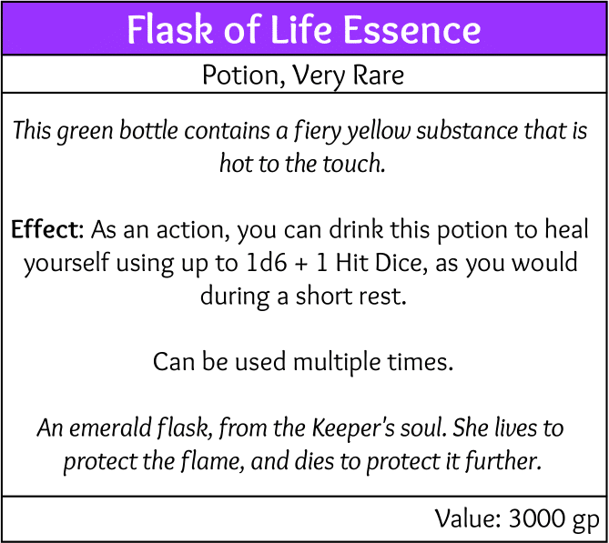

# Flask of Life Essence
>  Pomimo, że pierwszy raz spotykam się z przedmiotem takim jak ten, to jednego jestem pewien... To nie jest eliksir. To żarząca się esencja życia zamknięta w butelce.  
> \- [Gallas](Gallas.md)
## Wygląd
Mała zielona buteleczka ze złotą gorącą cieczo-podobną substancją w środku.
## Właściwości przedmiotu
Postać może wypić ciekły ogień z buteleczki, aby odnowić HP równe 1d6 + 1 Hit Dice, tak jak podczas Short Rest'u. Poziom ciekłego ognia w butelce jest zależny od witalności i stanu postaci.
## Historia
Ta niewielka buteleczka została prawdopodobnie porzucona lub zapomniana przez nieznanego poszukiwacza przygód nocującego w [jaskinii nieopodal Foristin](Jaskinia%20obok%20Foristin.md). Została znaleziona przez [Yalindora](Yalindor.md) w torbie obok ogniska w które był wbity kręcony miecz. Obecnie należy do [Drużyny Pięcienia](Dru%C5%BCyna%20Pi%C4%99cienia.md).
## Wydarzenia
- [Poszukiwanie żółtego kryształu](Poszukiwanie%20%C5%BC%C3%B3%C5%82tego%20kryszta%C5%82u.md) → Odnalezienie przedmiotu
## Karta przedmiotu:  

  

## Ciekawostki
Przedmiot jest wprost zerżnięty od Butelki Estusa z serii *Dark Souls*.