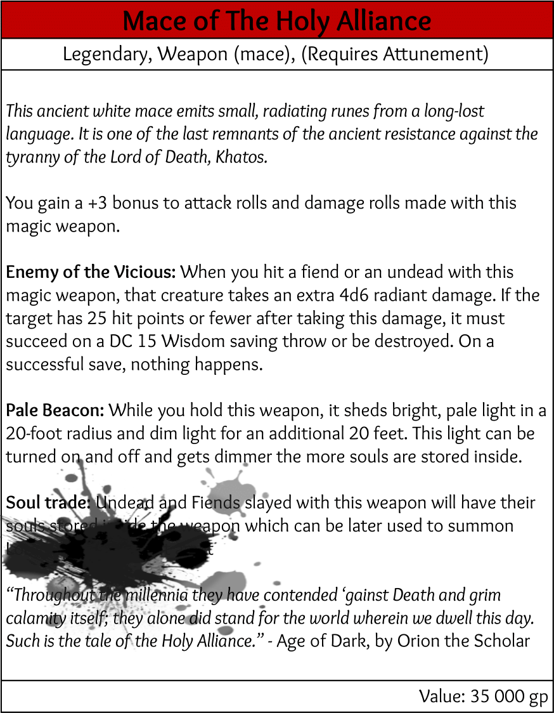

# Nazwa przedmiotu
> Cytat
> \- [[Gallas]]
## Wygląd
Buzdygan - podłużna obuchowa broń, typowo używana przez kleryków. 
Posiada szorstką metaliczną owalną rękojeść, na której wtopiony jest przełącznik.
Pod rękojeścią znajduje się krótki skórzany uchwyt.
## Właściwości przedmiotu
Dodatkowe +3 do trafienia oraz zadawanych obrażeń.

**Enemy of the Vicious:** Broń wymagająca przywiązania. Najlepiej działająca w walce z nieumarłymi i demonami, przez swoje 4d6 dodatkowych świętych obrażeń dla tych ras. Dodatkowo, jeżeli przeciwnik po otrzymaniu obrażeń ma mniej niż 25 HP, musi wykonać Saving throw'a na 15 Wisdom'u, w przeciwnym razie zginąć. 

**Pale Beacon:** Przełącznik widoczny na rękojeści pozwala włączyć maczudze generowanie jasnego, bladego światła na 20 stóp, a na kolejne 20 stóp słabego oświetlenia. Jakość światła jest zależna od posiadanych ładunków, przy wysokim naładowaniu, światło staje się o wiele słabsze i bordowe. 

**Soul trade:** Po pokonaniu nieumarłego lub demona, maczuga wsysa duszę przeciwnika w postaci ładunku. Użytkownik może jako Akcję przyzwać summona kosztem ładunków.

Summona można przyzwać dwoma metodami (obie zużywają Akcję):
- Przez wywołanie nazwy danego summona, zakładając, że ma się wystarczająco ładunków.
- Przeniesienie się do wymiaru maczugi.

Wymiar maczugi jest przedstawiony jako biała, jasna przestrzeń lub bardzo ciemna, w zależności od ilości ładunków. Po wejściu do wymiaru maczugi, ukazują się rzędy kamiennych piedestałów. Dotknięcie piedestału jest równoznaczne z wybraniem summona. 

I rząd:
- [Avenger](Summon%20-%20Avenger.md)
- [Defender](Summon%20-%20Defender.md)

II rząd:
- [Champion](Summon%20-%20Champion.md)

III rząd:
- [Skrzydło](Summon%20-%20Skrzydło.md)
- [Oko](Summon%20-%20Oko.md)
## Historia
Przeszłość przedmiotu
## Wydarzenia
- Story Arc → wydarzenie
## Karta przedmiotu

## Ciekawostki

- Broń wzorowana na Mace of Disruption z d&d 5e.
- Umiejętność maczugi do przenoszenia się w inny wymiar można wykorzystać w celach defensywnych.
- Do innego wymiaru można zabierać dodatkowe osoby.